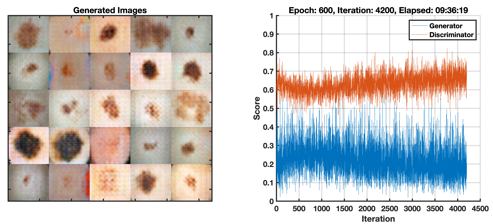
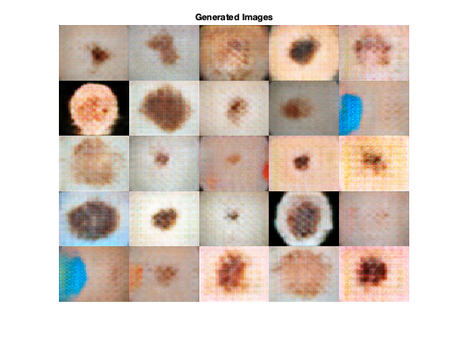

# Synthetic skin lesion image generation using GANs
This repository shows an example of how to use MATLAB to generate synthetic images of skin lesions.

The training data set consists of annotated images from the [ISIC 2016 challenge](https://challenge.isic-archive.com/data), Task 3 (Lesion classification) data set, containing 900 dermoscopic lesion images in JPEG format[1](#myfootnote1).

The code is based on an [example using the flowers dataset available online](https://www.mathworks.com/help/deeplearning/ug/train-generative-adversarial-network.html). 

|  |
|:--:|
| Snapshot of the GAN after training. (L) generated images; (R) generator (blue) and discriminator (red) curves showing score (between 0 and 1, where 0.5 is best) for each iteration.|

|  |
|:--:|
| Examples of synthetically generated images.|
## Requirements
- [X]  [MATLAB 2021a](https://www.mathworks.com/products/matlab.html) or later
- [X]  [Deep Learning Toolbox](https://www.mathworks.com/products/deep-learning.html)
- [ ]  [Parallel Computing Toolbox](https://www.mathworks.com/products/parallel-computing.html) (only required for training using a GPU)
## Suggested steps
1. Download or clone the repository.
2. Open MATLAB.
3. Edit the contents of the `imageFolder` variable in the `skin_lesion_gan.mlx` file to reflect the path to your selected dataset. 
4. Run the `skin_lesion_gan.mlx` script and inspect results.
## Additional remarks

- You are encouraged to expand and adapt the example to your needs.
- The choice of network architectures for both the generator and discriminator was inspired by the [DCGAN](https://paperswithcode.com/paper/unsupervised-representation-learning-with-1).
- The choice of  hyperparameters (learning rate, mini-batch size, number of epochs, etc.) is merely illustrative. You are encouraged to (use [Experiment Manager](https://www.mathworks.com/help/deeplearning/ref/experimentmanager-app.html) to) tweak those choices and find a better solution [2](#myfootnote2).
## Notes
<a name="myfootnote1">[1]</a> This example uses a fairly small subset of images to make it easier to get started without having to worry about large downloads and long training times. 

<a name="myfootnote2">[2]</a> See [this](https://www.mathworks.com/matlabcentral/fileexchange/93980-managing-medical-image-classification-experiments?s_tid=prof_contriblnk) for ideas and example code for using MATLAB Experiment Manager.   
